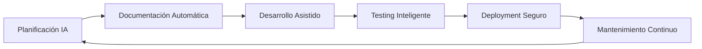

# Guía Experta del Método B-MAD

## 📋 Índice
1. [Introducción al Método B-MAD](#introducción-al-método-b-mad)
2. [Arquitectura del Sistema](#arquitectura-del-sistema)
3. [Agentes Especializados](#agentes-especializados)
4. [Workflows Fundamentales](#workflows-fundamentales)
5. [Desarrollo Brownfield (Legacy)](#desarrollo-brownfield-legacy)
6. [Desarrollo Greenfield (Nuevo)](#desarrollo-greenfield-nuevo)
7. [Gestión de Calidad y Testing](#gestión-de-calidad-y-testing)
8. [Mejores Prácticas](#mejores-prácticas)
9. [Herramientas y Utilidades](#herramientas-y-utilidades)
10. [Casos de Uso Avanzados](#casos-de-uso-avanzados)
11. [Troubleshooting](#troubleshooting)

---

## Introducción al Método B-MAD

### ¿Qué es B-MAD?

**B-MAD (Business Methodology for AI-Driven Development)** es un framework de desarrollo de software que integra inteligencia artificial en cada fase del ciclo de vida del desarrollo. Su objetivo principal es automatizar y optimizar procesos de desarrollo mediante agentes especializados que emulan roles tradicionales de equipos de software.

### Filosofía Central



### Principios Fundamentales

1. **Especialización por Roles**: Cada agente está optimizado para una función específica
2. **Documentación como Código**: Toda la planificación genera artefactos reutilizables
3. **Seguridad en Brownfield**: Prioridad en no romper funcionalidad existente
4. **Trazabilidad Completa**: Desde requisitos hasta implementación
5. **Iteración Ágil**: Ciclos cortos con validación continua

---

## Arquitectura del Sistema

### Estructura de Directorios

```
proyecto/
├── .bmad-core/                 # Core del framework
│   ├── agents/                 # Definiciones de agentes
│   ├── tasks/                  # Tareas ejecutables
│   ├── templates/              # Plantillas de documentos
│   ├── checklists/             # Listas de verificación
│   ├── workflows/              # Flujos de trabajo
│   └── core-config.yaml        # Configuración principal
├── docs/                       # Documentación del proyecto
│   ├── prd.md                  # Product Requirements Document
│   ├── architecture.md         # Arquitectura del sistema
│   ├── epics/                  # Épicas fragmentadas
│   ├── stories/                # Historias de usuario
│   └── qa/                     # Documentación de QA
└── src/                        # Código fuente
```

### Configuración Core

El archivo `core-config.yaml` define:
- Configuración de agentes
- Rutas de documentos
- Políticas de validación
- Integraciones con herramientas

---

## Agentes Especializados

### 🧙 BMad Master (`@bmad-master`)
**Rol**: Ejecutor universal de tareas
- **Cuándo usar**: Tareas generales, comandos únicos, exploración
- **Comandos principales**: `*help`, `*kb`, `*create`
- **Fortalezas**: Versatilidad, acceso a todos los recursos

### 🎯 Product Manager (`@pm`)
**Rol**: Gestión de productos y requisitos
- **Tareas principales**:
  - `*create-prd`: Crear Product Requirements Document
  - `*create-brownfield-prd`: PRD para proyectos existentes
  - `*create-epic`: Crear épicas
  - `*create-story`: Crear historias de usuario
- **Artefactos**: PRDs, épicas, historias, roadmaps

### 🏗️ Architect (`@architect`)
**Rol**: Diseño de arquitectura y sistemas
- **Tareas principales**:
  - `*document-project`: Documentar proyecto existente
  - `*create-architecture`: Diseñar arquitectura
  - `*create-brownfield-architecture`: Arquitectura para legacy
- **Especialización**: Patrones de diseño, integración de sistemas

### 👨‍💻 Developer (`@dev`)
**Rol**: Implementación y desarrollo
- **Tareas principales**:
  - `*implement-story`: Implementar historia de usuario
  - `*refactor`: Refactoring de código
  - `*debug`: Debugging asistido
- **Fortalezas**: Generación de código, resolución de problemas

### 🔍 Quality Assurance (`@qa`)
**Rol**: Gestión de calidad y testing
- **Comandos críticos**:
  - `*risk`: Análisis de riesgos
  - `*design`: Diseño de tests
  - `*trace`: Trazabilidad de requisitos
  - `*nfr`: Validación de requisitos no funcionales
  - `*review`: Revisión completa
  - `*gate`: Actualización de gates de calidad

### 📋 Product Owner (`@po`)
**Rol**: Validación y gestión de backlog
- **Tareas principales**:
  - `*execute-checklist-po`: Checklist maestro
  - `*shard`: Fragmentar documentos
  - `*validate`: Validar alineación de documentos

### 🎨 UX Expert (`@ux-expert`)
**Rol**: Experiencia de usuario y diseño
- **Especialización**: Wireframes, especificaciones de UI, prototipos
- **Integración**: Generación de prompts para herramientas como V0/Lovable

### 📊 Business Analyst (`@analyst`)
**Rol**: Análisis de negocio e investigación
- **Tareas**: Investigación de mercado, análisis competitivo, project briefs

### 🏃‍♂️ Scrum Master (`@sm`)
**Rol**: Gestión ágil y facilitación
- **Enfoque**: Sprint planning, retrospectivas, eliminación de impedimentos

### 🎭 BMad Orchestrator (`@bmad-orchestrator`)
**Rol**: Coordinación entre agentes
- **Uso**: Flujos complejos multi-agente, coordinación de workflows

---

## Workflows Fundamentales

### Workflow de Planificación (Web UI)

```mermaid
graph TD
    A[Idea del Proyecto] --> B{¿Investigación Necesaria?}
    B -->|Sí| C[@analyst: Investigación]
    B -->|No| D[@pm: Crear PRD]
    C --> D
    D --> E{¿UX Requerido?}
    E -->|Sí| F[@ux-expert: Especificaciones]
    E -->|No| G[@architect: Arquitectura]
    F --> G
    G --> H[@qa: Estrategia Testing]
    H --> I[@po: Checklist Maestro]
    I --> J{¿Documentos Alineados?}
    J -->|No| K[Revisar y Ajustar]
    J -->|Sí| L[Planificación Completa]
    K --> I
    L --> M[Transición a IDE]
```

### Workflow de Desarrollo (IDE)

```mermaid
graph TD
    A[Documentos Shardados] --> B[@sm: Sprint Planning]
    B --> C[@dev: Implementar Stories]
    C --> D[@qa: Testing Continuo]
    D --> E{¿Calidad OK?}
    E -->|No| F[@dev: Corregir Issues]
    E -->|Sí| G[@po: Validar Funcionalidad]
    F --> D
    G --> H{¿Sprint Completo?}
    H -->|No| C
    H -->|Sí| I[@sm: Sprint Review]
    I --> J[Deploy]
```

---

## Desarrollo Brownfield (Legacy)

### Características Especiales para Brownfield

El método B-MAD destaca especialmente en proyectos **brownfield** (sistemas existentes):

#### 1. Documentación Automática del Estado Actual

```bash
# Documentar proyecto existente
@architect
*document-project
```

**El architect genera**:
- Análisis de arquitectura actual
- Mapeo de dependencias
- Identificación de patrones existentes
- Documentación de APIs y contratos

#### 2. Estrategias de Planificación Brownfield

##### Enfoque A: PRD-First (Recomendado)
```bash
# 1. Crear PRD enfocado
@pm
*create-brownfield-prd

# 2. Documentar solo áreas relevantes
@architect
*document-project
```

**Ventajas**:
- Más eficiente para sistemas grandes
- Documenta solo lo necesario
- Evita sobrecarga de documentación

##### Enfoque B: Document-First
```bash
# 1. Documentar todo el sistema
@architect
*document-project

# 2. Crear PRD con contexto completo
@pm
*create-brownfield-prd
```

**Ventajas**:
- Comprensión completa del sistema
- Mejor para sistemas desconocidos
- Reduce riesgos de breaking changes

#### 3. Testing Especializado para Brownfield

```bash
# Análisis de riesgos (CRÍTICO)
@qa *risk {brownfield-story}

# Diseño de tests
@qa *design {brownfield-story}

# Trazabilidad de requisitos
@qa *trace {brownfield-story}

# Validación NFR
@qa *nfr {brownfield-story}

# Revisión completa
@qa *review {brownfield-story}
```

#### 4. Escenarios Brownfield Comunes

| Escenario | Comandos Recomendados | Consideraciones Especiales |
|-----------|----------------------|---------------------------|
| **Agregar Feature a Legacy** | `*risk` → `*design` → `*trace` → `*review` | Mapear todas las dependencias |
| **Modificación de API** | `*risk` → `*design` → `*nfr` → `*review` | Prevenir breaking changes |
| **Cambio Performance-Critical** | `*nfr` (continuo) → `*review` | Monitoreo constante |
| **Migración de Datos** | Ciclo completo + `*gate` | Integridad de datos crítica |
| **Bug Fix en Sistema Complejo** | `*risk` → `*trace` → `*review` | Prevenir efectos secundarios |

---

## Desarrollo Greenfield (Nuevo)

### Workflow Estándar Greenfield

Para proyectos nuevos, B-MAD sigue un proceso más tradicional pero acelerado:

#### Fase 1: Investigación y Análisis (Opcional)
```bash
@analyst
*brainstorming         # Generación de ideas
*market-research       # Investigación de mercado
*competitor-analysis   # Análisis competitivo
*create-project-brief  # Brief del proyecto
```

#### Fase 2: Definición de Requisitos
```bash
@pm
*create-prd           # PRD desde cero o brief
```

#### Fase 3: Diseño UX (Si aplica)
```bash
@ux-expert
*create-frontend-spec  # Especificaciones de UI
*generate-ui-prompt    # Prompts para V0/Lovable
```

#### Fase 4: Arquitectura
```bash
@architect
*create-architecture  # Arquitectura del sistema
```

#### Fase 5: Validación
```bash
@po
*execute-checklist-po  # Validación completa
```

---

## Gestión de Calidad y Testing

### El Test Architect (Quinn) para Brownfield

En proyectos brownfield, el agente QA se convierte en un **Test Architect** especializado:

#### Análisis de Riesgos Avanzado

```yaml
Risk Scoring para Brownfield:
- Regression Risk: Puntos de integración × Edad del código
- Data Risk: Complejidad migración × Volumen de datos  
- Performance Risk: Carga actual × Complejidad añadida
- Compatibility Risk: Consumidores API × Cambios de contrato
```

#### Gates de Calidad

| Gate | Criterio | Acción si Falla |
|------|----------|----------------|
| **FAIL** | Score ≥9 regresión o compatibilidad | Bloqueo de deployment |
| **CONCERNS** | Score ≥6 datos o performance | Revisión adicional requerida |
| **PASS** | Todos los scores < 6 | Proceder con deployment |

#### Testing Standards para Brownfield

1. **Regression Test Coverage**: Todo módulo legacy tocado necesita tests
2. **Performance Baselines**: Mantener o mejorar métricas actuales
3. **Rollback Procedures**: Todo cambio necesita plan de rollback
4. **Feature Flags**: Cambios riesgosos detrás de toggles
5. **Integration Tests**: Cubrir todos los puntos de contacto legacy
6. **Contract Tests**: Validar compatibilidad de APIs
7. **Data Validation**: Verificar corrección de migraciones

---

## Mejores Prácticas

### 1. Gestión de Documentos

#### Estructura Recomendada
```
docs/
├── prd.md                    # Documento maestro
├── architecture.md           # Arquitectura completa
├── epics/
│   ├── epic-001-user-auth.md
│   └── epic-002-payments.md
├── stories/
│   ├── user-auth/
│   │   ├── story-001-login.md
│   │   └── story-002-register.md
│   └── payments/
└── qa/
    ├── assessments/
    └── gates/
```

#### Versionado de Documentos
```bash
# Para múltiples versiones
docs/
├── brownfield-prd.md        # Versión brownfield
├── greenfield-prd.md        # Versión greenfield
└── current-prd.md           # Versión actual activa
```

### 2. Comando y Sintaxis

#### Comandos con Prefijo Asterisco
```bash
# Comandos siempre requieren *
*help                    # Ver ayuda
*create                  # Crear recurso
*validate               # Validar documento
*shard                  # Fragmentar documento
```

#### Referenciación de Artefactos
```bash
# Formato para referenciar stories
@qa *risk {epic}.{story}
@qa *review user-auth.login-implementation
```

### 3. Transición Web UI ↔ IDE

#### De Web UI a IDE
1. **Completar planificación** en Web UI (costo eficiente)
2. **Copiar documentos** a `docs/` del proyecto
3. **Abrir proyecto** en IDE con soporte B-MAD
4. **Shard documentos** con PO
5. **Iniciar desarrollo** con SM/Dev

#### Ventajas de cada Entorno
| Aspecto | Web UI | IDE |
|---------|--------|-----|
| **Costo** | Menor | Mayor |
| **Contexto** | Limitado | Completo |
| **Planificación** | Excelente | Bueno |
| **Desarrollo** | No disponible | Excelente |
| **Debugging** | No disponible | Excelente |

### 4. Gestión de Agentes

#### Selección de Agente Apropiado

```mermaid
graph TD
    A[Necesidad] --> B{Tipo de Tarea}
    B -->|Planificación| C[@pm]
    B -->|Arquitectura| D[@architect] 
    B -->|Implementación| E[@dev]
    B -->|Testing| F[@qa]
    B -->|Validación| G[@po]
    B -->|UX/UI| H[@ux-expert]
    B -->|General| I[@bmad-master]
    B -->|Coordinación| J[@bmad-orchestrator]
```

#### Secuencia de Agentes Típica

**Para Feature Nueva**:
```
@pm → @architect → @ux-expert → @qa → @po → @dev → @qa → @po
```

**Para Bug Fix**:
```
@qa → @dev → @qa → @po
```

**Para Refactoring**:
```
@architect → @qa → @dev → @qa → @po
```

---

## Herramientas y Utilidades

### 1. Flattener Tool

Herramienta para convertir proyectos en archivos XML únicos:

```bash
# Instalar flattener
npx bmad-method flatten

# Genera: flattened-codebase.xml
```

**Usos**:
- Upload a agentes web con contexto limitado
- Backup de estado del proyecto
- Análisis de código por herramientas externas

### 2. Templates del Sistema

#### Templates Principales
- **PRD Template**: Estructura estándar para requisitos
- **Architecture Template**: Plantilla de documentación arquitectural
- **Story Template**: Formato de historias de usuario
- **Epic Template**: Estructura de épicas
- **Checklist Templates**: Listas de verificación por rol

#### Customización de Templates
```yaml
# En core-config.yaml
templates:
  prd: custom-prd-template.md
  architecture: custom-arch-template.md
  story: custom-story-template.md
```

### 3. Checklists Automáticos

#### Checklist del PO (Master)
- ✅ PRD completo y validado
- ✅ Arquitectura alineada con PRD
- ✅ Épicas creadas y priorizadas
- ✅ Stories técnicamente viables
- ✅ Criterios de aceptación claros
- ✅ NFRs identificados
- ✅ Riesgos documentados

#### Checklist del QA
- ✅ Estrategia de testing definida
- ✅ Casos de test diseñados
- ✅ NFRs validables
- ✅ Riesgos de regresión identificados
- ✅ Performance baselines establecidos

---

## Casos de Uso Avanzados

### 1. Monolito → Microservicios

```bash
# Fase 1: Documentar monolito actual
@architect *document-project

# Fase 2: Planificar extracción
@pm *create-brownfield-prd
# Especificar: "Extraer servicio de pagos del monolito"

# Fase 3: Diseñar boundaries
@architect *create-brownfield-architecture

# Fase 4: Análisis de riesgos
@qa *risk microservice-extraction.payment-service

# Fase 5: Implementación gradual con Strangler Fig
@dev *implement-story payment-service.api-gateway
```

### 2. Modernización de Legacy

```bash
# Análisis del sistema legacy
@architect *document-project

# Estrategia de modernización
@pm *create-brownfield-prd
# Especificar: "Modernizar sistema legacy PHP a Node.js"

# Mapeo de componentes críticos
@qa *trace legacy-migration.core-modules

# Plan de migración gradual
@architect *create-brownfield-architecture
```

### 3. Integración de AI/ML

```bash
# Evaluar capacidades actuales
@architect *document-project

# Definir casos de uso de AI
@analyst *brainstorming
@pm *create-prd

# Diseñar pipeline de ML
@architect *create-architecture

# Validar performance y escalabilidad
@qa *nfr ai-integration.ml-pipeline
```

### 4. Multi-tenancy en SaaS

```bash
# Documentar arquitectura actual
@architect *document-project

# Planificar multi-tenancy
@pm *create-brownfield-prd

# Diseñar isolation strategy
@architect *create-brownfield-architecture

# Análisis de seguridad y performance
@qa *nfr multi-tenancy.data-isolation
@qa *risk multi-tenancy.security-boundaries
```

---

## Troubleshooting

### Problemas Comunes y Soluciones

#### 1. Agente No Responde Correctamente

**Síntoma**: El agente no ejecuta la tarea esperada
**Solución**:
```bash
# Verificar activación correcta
@{agente}
*help

# Reactivar agente si es necesario
@bmad-master
*activate {agente}
```

#### 2. Documentos Desalineados

**Síntoma**: PRD y arquitectura no coinciden
**Solución**:
```bash
@po
*execute-checklist-po
# Seguir recomendaciones del checklist

# Si persiste el problema
@pm *update-prd
@architect *update-architecture
```

#### 3. Tests Fallando Continuamente

**Síntoma**: Gates de QA siempre en FAIL
**Solución**:
```bash
# Revisar criterios de riesgo
@qa *risk {story}

# Ajustar estrategia si es necesario
@qa *design {story}

# Considerar feature flags
@dev *implement-feature-flag {feature}
```

#### 4. Performance de Agentes Lenta

**Síntoma**: Respuestas muy lentas
**Solución**:
- Usar Web UI para planificación (más eficiente)
- Fragmentar tareas grandes en subtareas
- Verificar contexto del agente no esté sobrecargado

#### 5. Conflictos de Versionado

**Síntoma**: Múltiples versiones de documentos
**Solución**:
```bash
# Establecer versión canónica
@po *validate docs/prd.md

# Archivar versiones obsoletas
mv docs/old-prd.md docs/archive/
```

### Debug de Workflows

#### Verificar Estado del Workflow
```bash
@bmad-master
*status
# Muestra estado actual del proyecto

@po
*validate-all
# Valida todos los documentos
```

#### Logs y Trazabilidad
```bash
@qa
*trace {epic}.{story}
# Muestra trazabilidad completa

@bmad-master
*history
# Historial de comandos ejecutados
```

---

## Conclusiones

### Fortalezas del Método B-MAD

1. **Especialización Inteligente**: Cada agente optimizado para su rol
2. **Seguridad en Brownfield**: Enfoque único en preservar funcionalidad existente
3. **Documentación Automática**: Reduce overhead manual significativamente
4. **Gestión de Riesgos Proactiva**: Identificación temprana de problemas
5. **Escalabilidad**: Funciona desde proyectos pequeños hasta enterprise
6. **Trazabilidad Completa**: Desde requisitos hasta implementación

### Casos de Uso Ideales

- **Modernización de sistemas legacy**
- **Proyectos con alta complejidad técnica**
- **Equipos que requieren documentación rigurosa**
- **Desarrollo distribuido con múltiples stakeholders**
- **Proyectos con requisitos de calidad estrictos**

### Consideraciones de Adopción

#### Curva de Aprendizaje
- **Inicial**: Moderada (1-2 semanas)
- **Competencia**: 4-6 semanas
- **Maestría**: 2-3 meses

#### Inversión Requerida
- **Setup inicial**: Configuración de agentes y templates
- **Training**: Capacitación del equipo en metodología
- **Herramientas**: IDEs con soporte B-MAD o acceso a Web UI

#### ROI Esperado
- **Reducción documentación manual**: 70-80%
- **Detección temprana de bugs**: 60-70%
- **Velocidad de planificación**: 50-60% más rápido
- **Calidad de entregables**: Mejora significativa

### Roadmap de Adopción Recomendado

#### Fase 1: Piloto (4-6 semanas)
- Seleccionar proyecto pequeño brownfield
- Capacitar 2-3 desarrolladores clave
- Ejecutar workflow completo
- Documentar lessons learned

#### Fase 2: Expansión (8-12 semanas)
- Aplicar a proyecto mediano
- Capacitar resto del equipo
- Refinar templates y procesos
- Establecer métricas de éxito

#### Fase 3: Adopción Completa (12+ semanas)
- Implementar en todos los proyectos
- Customizar metodología para la organización
- Establecer centros de excelencia
- Mentoría continua

---

**Este documento sirve como guía completa para el uso experto del método B-MAD. Para información específica adicional, consulte la documentación oficial en `.bmad-core/` y los ejemplos de implementación en su proyecto.**
